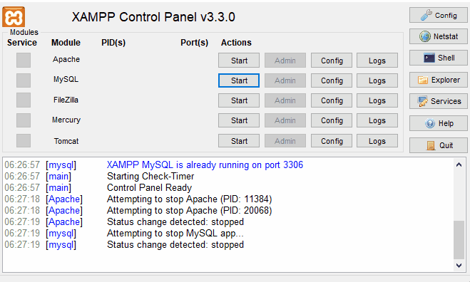

# Subscribe to newsletter


Subscribtion form, where users can subscribe to newsletters.

## Built with

- Semantic HTML5 markup
- [Sass](https://sass-lang.com/) - CSS pre-processor
- [React](https://reactjs.org/) - JS library
- [PHP](https://php.net/)
- [MySQL](https://www.mysql.com/) - database

## Installation

To run this application local on your computer you need install [XAMPP](https://www.apachefriends.org/index.html)

Download ZIP or clone repository to C:\xampp\htdocs folder

```bash
(https://github.com/Sergio0831/subscription-form.git)
```

Navigate to frontend folder.
Use the package manager [npm](https://docs.npmjs.com/downloading-and-installing-node-js-and-npm) to install all packages.

```bash
cd ./frontend
npm install
```

## Usage

To run frontend part, got to frontend folder and run

```bash
cd ./frontend
npm run start
```

To build app

```bash
npm run build
```

To test app

```bash
npm run test
```

### :file_folder: Folders structure frontend

```bash
frontend
    |-- node_modules
    |-- public
    |-- src
    |   |-- components
    |   |-- fonts           # Fonts for icons
    |   |-- images          # All images
    |   |-- sassStyles      # Sass styles
```

### :file_folder: Files backend

```bash
backend
    |-- CreateDb.php        # Create Database class
    |-- delete.php          # Delete subscriptions
    |-- export.php          # Export subscriptions to CSV file
    |-- index.php           # Main file for table
    |-- insert.php           # Insert subscriptions to the database
```

To run backend part start your XAMPP server



Link where you can see all subscribtions

```bash
(http://localhost/subscription-form/backend/index.php)
```

- **Export to CSV** button to export all subscriptions to the CSV file.
- Search by **name** or by **date**
- Delete subscription by pressing **Delete** button

### Database

```bash
    Database name:  "Subscriptions",
    Table name:     "Emails",
    Server name:    "localhost",
    User name:      "root",
    Password:       ""
```

## Coded By

- Website - [Sergejs Ivcenko](https://www.ivcenko.name)
- GitHub - [Sergejs Ivcenko](https://github.com/Sergio0831)
- LinkedIn - [Sergejs Ivcenko](https://www.linkedin.com/in/ivcenko/)
